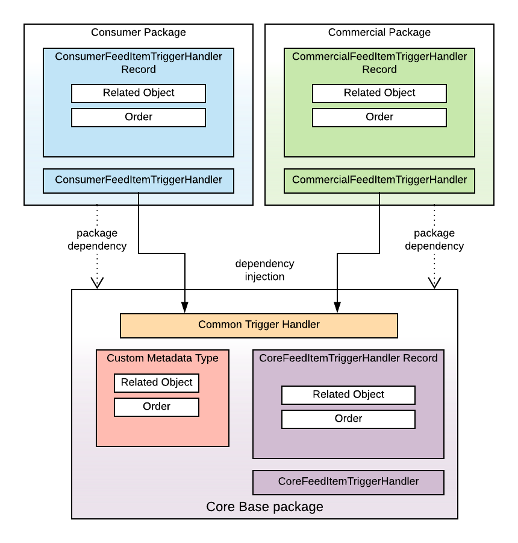
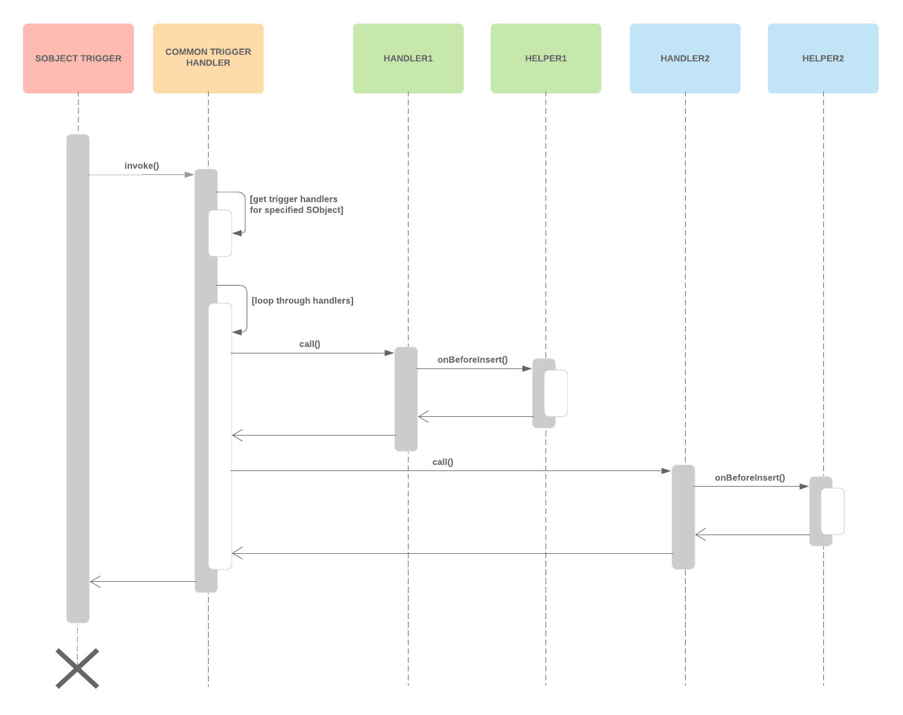

# SFDX Trigger Framework

## Purpose
With the introduction of Salesforce DX packages, the ability to have a single trigger associated with an object becomes more difficult. This is because a single trigger has to referece fields that are potentially located in several packages.

## Structure

### Class Diagram

### Sequence Diagram

## Example
